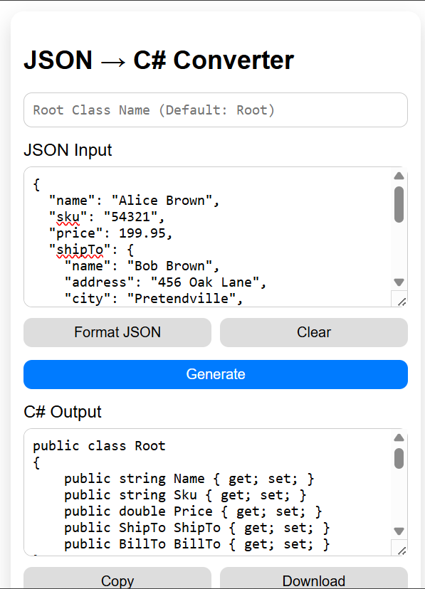
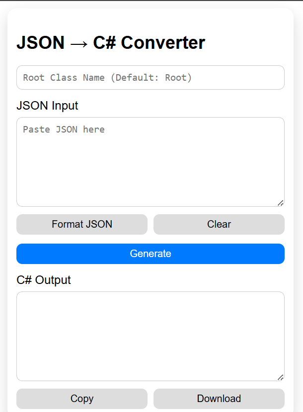

# JSON → C# Chrome Extension

A lightweight Chrome extension to convert JSON into clean, strongly-typed C# classes instantly.

---

## ✨ Features

- 🔄 Convert JSON to C# classes in one click
- 🧠 Smart type inference (`int`, `double`, `bool`, `DateTime`)
- 🧩 Handles nested objects and arrays
- ⚡ Merges array objects into a single model
- 🟡 Nullable support for missing or null fields
- 📋 Copy to clipboard
- 📥 Download as `.cs` file
- 🎯 Clean and minimal UI

---

## 🚀 Getting Started

### 1. Clone the repository

```bash
git clone https://github.com/YOUR_USERNAME/json-to-csharp-chrome-extension.git
cd json-to-csharp-chrome-extension
```

---

### 2. Install dependencies

```bash
npm install
```

---

### 3. Build the extension

```bash
npm run build
```

---

### 4. Load in Chrome

1. Open Chrome and go to:
   `chrome://extensions/`

2. Enable **Developer mode**

3. Click **Load unpacked**

4. Select the `/dist` folder

---

## 🧪 Usage

1. Click the extension icon
2. Paste your JSON input
3. Click **Generate**
4. Copy or download the generated C# classes

---

## 📸 Screenshots

### Output C#



### Full UI



- JSON input
- Generated C# output
- Full extension popup

---

## 🏗️ Project Structure

```
├── public/
│ ├── manifest.json
│ └── icons/
│
├── src/
│ ├── core/ # Conversion logic
│ │ ├── builder.ts
│ │ ├── converter.ts
│ │ ├── naming.ts
│ │ ├── parser.ts
│ │ └── typeResolver.ts
│ │
│ ├── popup/ # Extension UI
│ │ ├── popup.html
│ │ ├── popup.ts
│ │ └── style.css
│
├── tests/
│ └── test.ts
│
├── screenshots/ # README images
├── README.md
├── package.json
├── tsconfig.json
├── vite.config.ts
├── .gitignore
└── LICENSE
```

---

## ⚙️ Tech Stack

- TypeScript
- Vite
- Chrome Extensions (Manifest v3)

---

## 🧠 How It Works

- Parses JSON input
- Infers types dynamically
- Merges array objects into a unified structure
- Generates C# class definitions

---

## 📌 Notes

- Large JSON inputs may take slightly longer due to parsing and type inference
- The extension runs entirely on the client (no external API calls)

---

## 📄 License

This project is licensed under the MIT License.

---

## 🙌 Contributing

Feel free to open issues or submit pull requests for improvements.

---

## ⭐ If you found this useful

Consider giving the repo a star ⭐
